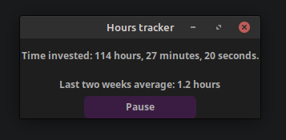
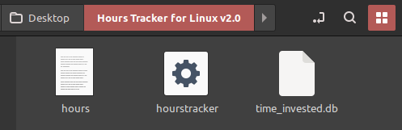

# Hours tracker in Python ⏰

This is an hour tracker I made in Python and using tkinter to track how much time I have invested in programming but it also could work to track any task that takes a lot to complete or to finish. It's inspired on the way Steam tracks the playtime on games



(It should look like this on the directory)



## Requirements

- Python 3.13.5 or higher

- CustomTkinter


## Features
1. Easy to use: You just open it and it starts tracking; and as soon as you close it, it gets saved to the .txt on the same directory

2. Lightweight: It simply uses tkinter for now, it's incredibly barebones to focus on what's important (tracking hours)

3. Modifiable: Since the data is inside a text file alongside the executable, you can change the hours counter by just changing the decimal number inside the file, and the code will change it into hours and minutes. The same applies for the .db file!

## How to run?

### Using the executable:

- Download the latest release, for now it's just Linux
 
    *Windows executable coming soon :)*

### Running the script:

- Make sure you have the requirements and then do this code:
```bash
python3 hourstracker.py
```
(It'll need the terminal to stay open to function, that's something I'll change)

## Future plans:

- [x] An average time with the app open in the past two weeks

- [x] Changing it to CustomTkinter

- [ ] Adding crash protections so the file doesn't die